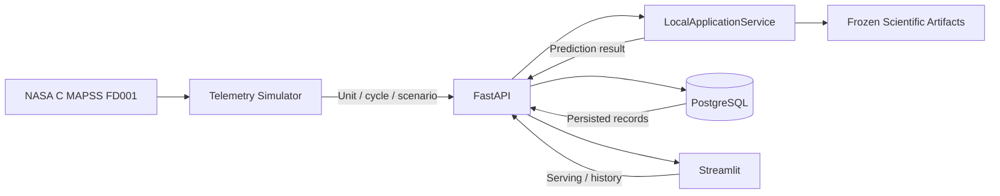
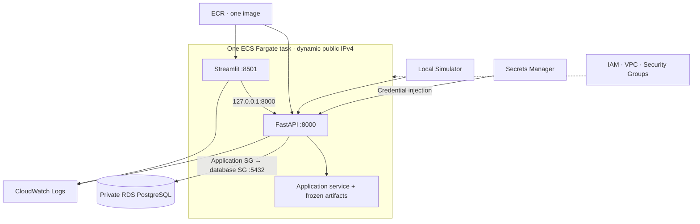
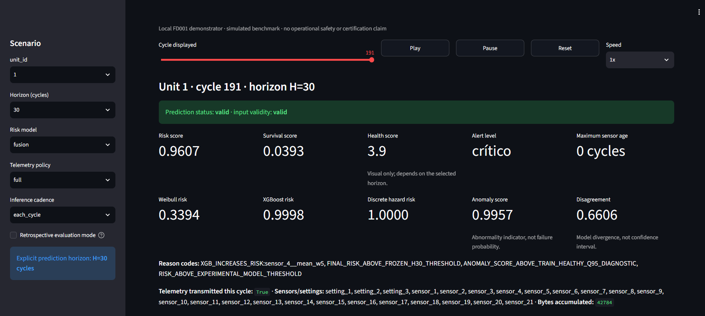
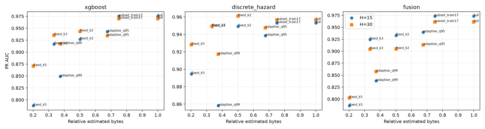
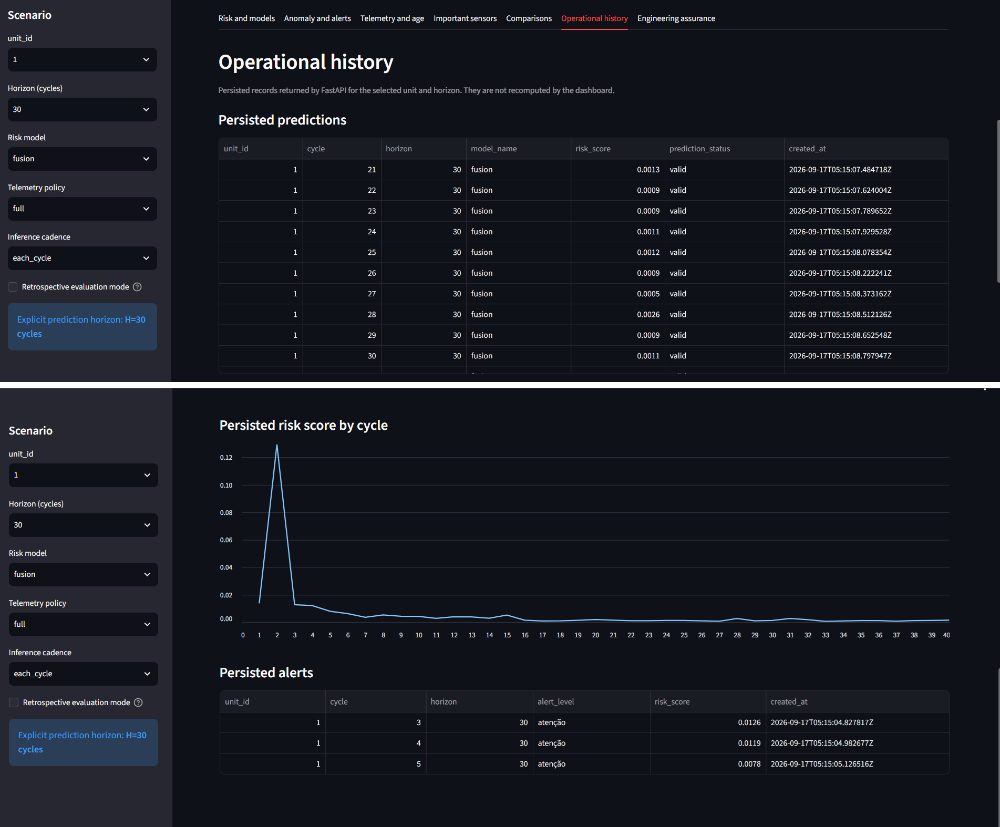
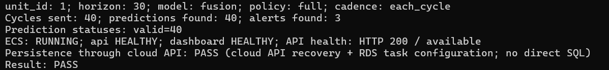
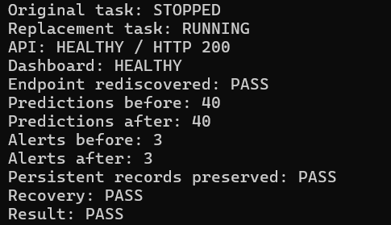
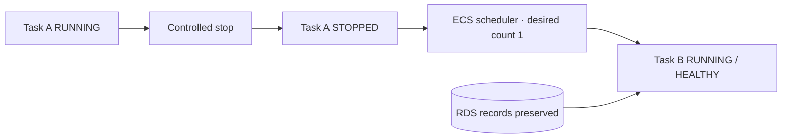

# Adaptive Predictive Maintenance Platform

**End to end predictive maintenance, reliability modeling and cloud deployment using NASA C MAPSS.**


[Case study](docs/portfolio_case_study.md) · [Scientific reports](reports/README.md) · [Cloud validation](docs/stage3_validation_report.md)

## Overview

An engineering demonstrator for estimating the probability of a simulated turbofan reaching its terminal event within **15 or 30 benchmark cycles**. Built on NASA C MAPSS FD001, it combines reliability modeling, causal time-series features, probabilistic machine learning, anomaly diagnostics and telemetry-reduction experiments.

Frozen artifacts are served through FastAPI, predictions and alerts are persisted in PostgreSQL, and Streamlit consumes the API. A Terraform-defined AWS LAB was validated through real replay and controlled ECS task replacement.

## Key capabilities

- Cycle-by-cycle replay with explicit unit, horizon, model and telemetry policy.
- Weibull, Random Forest, XGBoost, discrete hazard, TCN and Transformer models.
- Probabilistic fusion, Isolation Forest diagnostics, SHAP and unit-level metric intervals.
- Full, fixed-interval, sensor-subset and causal adaptive telemetry policies.
- API-backed operational history, Docker services and AWS deployment.
- Controlled task recovery with persistent database records.

## Architecture



Scientific semantics remain in the application service and scientific modules. The current API replays known benchmark scenarios; it is not a generic raw-sensor ingestion system.



[Local architecture](docs/stage2_architecture.md) · [AWS architecture](docs/stage3_architecture_plan.md)

## Dashboard



Unit 1, cycle 191, H30: risk, survival, visual health, alert level and model diagnostics. Playback advances one cycle at a time. Actual RUL appears only in retrospective evaluation mode.

[Additional screenshots](docs/assets/README.md)

<!-- Optional genuine recording: docs/assets/demo/dashboard_demo.gif -->

## Machine learning

Selected results on the **development validation** population:

| Model | Horizon | PR AUC | Brier |
|---|---:|---:|---:|
| Transformer | H15 | 0.987997 | 0.007844 |
| Transformer | H30 | 0.983398 | 0.017680 |
| Fusion | H15 | 0.9731 | 0.01269 |
| Fusion | H30 | 0.9610 | 0.02542 |

PR AUC uses the documented average-precision implementation. These are not official NASA test results.

```text
risk_score(t, H) = P(T_i <= t + H | information through t, T_i > t)
survival_score  = 1 - risk_score
health_score   = 100 * survival_score
```

Health is a horizon-dependent visual transformation, not a physical state. Anomaly score is an abnormality indicator, not failure probability. Disagreement is model divergence, not a confidence interval.

RUL is terminal cycle minus current cycle, bounded below by zero, and belongs to targets/evaluation. It is excluded from features. Splits, cross-validation and bootstrap preserve whole units; preprocessing uses training data. Internal test decisions are frozen before evaluation, and the official NASA test remains reserved.

Weibull provides a population age baseline, not a physical degradation model. Discrete hazard accumulates conditional step hazards. TCN and Transformer use causal sequences and coherent H15/H30 heads. **Neural models remain outside fusion** pending approved grouped out-of-sample predictions.

[Prediction contract](docs/prediction_contract.md) · [Transformer results](reports/transformer_report.md) · [Fusion results](reports/fusion_report.md)

## Telemetry efficiency

The training-selected `subset_train17` policy reduced estimated bytes by approximately **25%**, preserving the evaluated Fusion results without degraded/unavailable outputs. Aggressive temporal policies approached **80%** reduction, with performance, staleness or availability tradeoffs.



These results are limited to FD001 and the recorded configuration. Bytes are accounting estimates, not a real aircraft protocol. Receiver reconstruction uses causal hold-last-value with explicit age/validity; features use only received information.

[Telemetry experiments](reports/telemetry_filtering_report.md) · [Change impact](reports/telemetry_change_impact.md)

## Operational persistence



FastAPI persists predictions and alerts. Streamlit retrieves records through `/api/v1/predictions` and `/api/v1/alerts`, without direct database access or silent historical recomputation. API failures are explicit; API mode has no local scientific fallback.

## AWS deployment

The temporary **LAB** uses ECR, ECS Fargate, private encrypted RDS PostgreSQL, Secrets Manager, CloudWatch, IAM, VPC and Security Groups, defined with Terraform. Two containers share one image; Streamlit reaches FastAPI through loopback within the task.

Public ports are restricted to the operator CIDR; database ingress is restricted to the application Security Group. The LAB has no ALB, NAT Gateway, autoscaling or additional replicas. Restricted HTTP access, dynamic IPv4 and no application authentication limit its scope.

## End to end validation



Real operator-observed cloud replay: **unit 1 · H30 · Fusion · full telemetry · each-cycle inference**.

| Evidence | Result |
|---|---|
| Cycles / persisted predictions / persisted alerts | 40 / 40 / 3 |
| Valid prediction statuses | 40 |
| ECS / API / dashboard | RUNNING / HEALTHY / HEALTHY |
| API health | HTTP 200 |
| Persistence through cloud API / E2E | PASS / PASS |

Operational history was also confirmed visually in the cloud dashboard.

## Failure recovery



The original task was deliberately stopped while desired count remained 1. ECS created a healthy replacement, the endpoint was rediscovered, and **40 predictions and 3 alerts remained available** in RDS.



This verifies the exercised task-recovery scenario, not high availability or disaster recovery.

## Validation and assurance

| Stage | Scope | Status |
|---|---|---|
| 1 | Scientific methodology and local demonstrator | VALIDATED |
| 2 | Docker, API, persistence and dashboard integration | VALIDATED |
| 3 | AWS LAB replay, persistence and recovery | VALIDATED |

The recorded Stage 3 audit reported **84 focused tests passed**, **12 PowerShell scripts parsed on 5.1**, **25 protected files with preserved hashes**, **0 BLOCKER** and **0 MAJOR** findings. These are audit-specific counts, not the full test-suite total.

Requirements, traceability, assumptions, configuration and change-impact records organize engineering evidence. Validation assesses requirement suitability/completeness; verification checks implementation against requirements. SAE ARP4754B and ARP4761A are conceptual engineering references only. **VALIDATED applies to the experimental scope**, with no certification or conformity claim.

[Assurance case](docs/assurance_case.md) · [Configuration index](docs/configuration_index.md) · [Cloud evidence](docs/stage3_validation_report.md)

## Technology stack

| Category | Technologies |
|---|---|
| ML / data | NumPy, pandas, SciPy, scikit-learn, XGBoost, PyTorch, SHAP, Parquet |
| Application | FastAPI, Pydantic, Streamlit, HTTPX, SQLAlchemy, PostgreSQL |
| Cloud | ECR, ECS Fargate, RDS, Secrets Manager, CloudWatch, IAM |
| Infrastructure | Docker Compose, Terraform, VPC, Security Groups |
| Testing | pytest, API/AWS mocks, Streamlit AppTest, PowerShell |

## Repository structure

```text
configs/                     Scientific and application configurations
data/                        Local dataset workspace (excluded from Git)
src/predictive_maintenance/
  core/ data/ features/      Contracts and causal preparation
  models/                   Reliability, ML, anomaly, temporal, fusion
  filtering/ evaluation/    Telemetry and metrics
  application/              Scientific workflows and serving service
  api/ persistence/         HTTP and database history
  simulator/ ui/            Sequential replay and dashboard
infra/aws/                  Terraform and runtime adapters
scripts/ tests/             Operations and verification
reports/                    Results, model cards and frozen artifacts
docs/                       Methodology, assurance and deployment
  assets/                   Reviewed screenshots and result figures
notebooks/                  Exploration only
```

## Running locally

**Python 3.11.** Dataset files are not distributed. Before Docker build or scenario execution, restore the matching validated local demo snapshot:

```text
data/processed/fd001/validation.parquet
data/processed/fd001/split_manifest.json
```

Do not substitute splits, fabricate files or retrain to bypass missing inputs. [Publication/data notes](docs/portfolio_publication.md) describe this reproduction boundary and reference the original NASA dataset.

With Docker Desktop and the demo inputs available:

```powershell
# First build or code changes:
.\scripts\local_stack.ps1 rebuild
# Subsequent starts (no build):
.\scripts\local_stack.ps1 start
.\scripts\local_stack.ps1 status
.\scripts\local_stack.ps1 logs
.\scripts\local_stack.ps1 stop
```

Equivalent: `docker compose up --build` / `docker compose down`. Stopping preserves the PostgreSQL volume. Compose credentials are local development defaults.

[Dashboard](http://localhost:8501) · [API docs](http://localhost:8000/docs)

Without containers:

```powershell
py -3.11 -m venv .venv
.\.venv\Scripts\Activate.ps1
python -m pip install --no-build-isolation -e .
uvicorn predictive_maintenance.api.main:app --reload
```

In another activated terminal:

```powershell
$env:APP_BACKEND = "api"
$env:PREDICTIVE_MAINTENANCE_API_URL = "http://127.0.0.1:8000"
streamlit run src/predictive_maintenance/ui/streamlit_app.py
```

Persistence requires `DATABASE_URL` or the existing separate DB variables. Without configuration, history is explicitly unavailable.

```powershell
python -m predictive_maintenance.simulator.telemetry_producer --unit-id 1 --horizon 30 --model fusion --telemetry-policy full --cadence each_cycle --mode fast --interval 0 --max-cycles 40 --api-base-url http://127.0.0.1:8000
python -m pytest tests/test_api.py tests/test_api_persistence.py tests/test_api_client.py tests/test_simulator.py -q
```

Install pytest in the development environment. Load serialized models only from trusted sources. Dependency bounds are not a fully locked environment; effective versions are recorded in model cards.

## AWS LAB

Cloning does not create resources. Real deployment requires explicit operator actions and local AWS CLI authentication. **AWS charges may apply:** starting Fargate incurs compute/public IPv4 costs; stopping tasks does not stop RDS or remove storage, images, secrets or logs. RDS temporary stop is time-limited.

[Terraform setup](infra/aws/README.md) · [Cost plan](docs/stage3_cost_plan.md) · [Lifecycle and destruction](docs/stage3_resource_lifecycle.md)

## Limitations

- FD001 is simulated NASA benchmark data, not operational aircraft telemetry.
- No industrial generalization, real maintenance/dispatch suitability or operational safety claim.
- No certification, airworthiness or regulatory compliance claim.
- Experimental horizons, calibration and thresholds apply only to recorded configurations.
- Shared data, preprocessing, targets and runtime mean model diversity is not demonstrated independence.
- Small cloud LAB, without high-availability or production-readiness claims.
- No automatic retraining or drift management.
- A fresh clone requires the matching local dataset snapshot for the demo.

## Roadmap

**Stage 4 — future work:** CI/CD, controlled deployment, artifact promotion and rollback automation. Further extensions include real equipment data, streaming and edge execution, each requiring its own validation.
