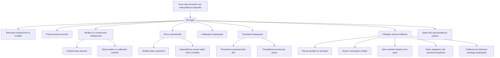

# Árvore lógica conceitual do aviso preditivo

Esta estrutura é inspirada em FTA apenas como mapa lógico de problemas do
demonstrador. Não é análise de certificação, não atribui severidade, não usa
probability budgets regulatórios e não pressupõe independência entre ramos.

**Top event interno:** aviso de manutenção do demonstrador não fornecido com a
antecedência requerida.

O conector OR indica que qualquer ramo pode ser suficiente para o top event.
Vários ramos podem ocorrer juntos: telemetria inválida pode causar preprocessing
incorreto, subestimação e indisponibilidade; uma configuração de horizonte
incorreta pode afetar modelo, calibrador e threshold. Portanto, somar
probabilidades ou multiplicar ramos como independentes seria injustificado.

Controles atuais incluem validação explícita da entrada, idade por sensor,
`telemetry_stale`, marca de transmissão, cadência de inferência configurável,
status `valid`, `degraded` e `unavailable`, alinhamento por chave/horizonte,
calibração cross-fitted, thresholds versionados, persistência configurável,
hashes e manifesto congelado. CLI e Streamlit apresentam estados e causas;
testes controlados cobrem modelo/artefato ausente, staleness, preprocessing e
risco inválido. Timestamps físicos, transporte real e objetivos de antecedência
industriais seguem fora da implementação. A árvore não foi quantificada.

## Extensão para a mudança de fluxo (0.11.0)

O ramo **B — preprocessing incorreto** inclui agora HLV tratado como amostra
nova, recuperação de sensor que não foi transmitido e incompatibilidade entre
artefato treinado e schema filtrado. O ramo **G — filtragem atrasa evidência**
inclui cadência reduzida que omite uma mudança, staleness que produz
`degraded/unavailable`, sensor requerido nunca inicializado e inferência apenas
na transmissão que posterga uma oportunidade de alerta. Esses ramos podem
compartilhar telemetria, preprocessing, runtime e configuração; nenhuma
independência é assumida e nenhum probability budget é calculado.

Durante a execução local, pacotes perdidos ou atrasados continuam modos
conceituais: o estudo mede políticas sequenciais e hold-last-value, não um
enlace físico. A evidência quantitativa de cada ramo é limitada às tabelas de
validation e ao recibo específico do `test_internal` após o freeze.
