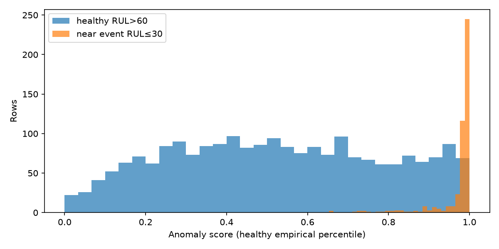
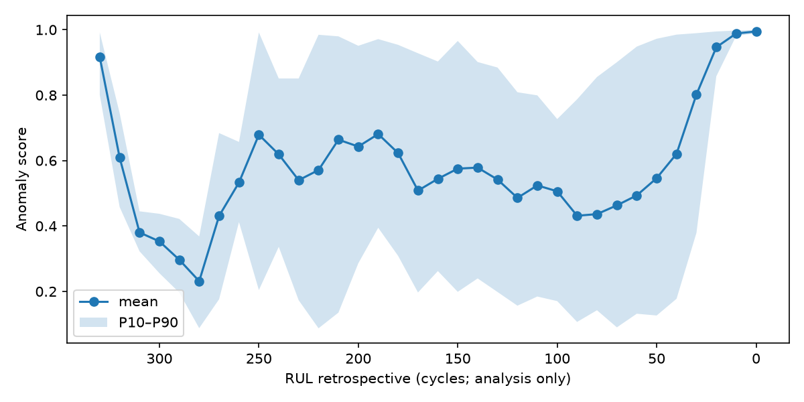
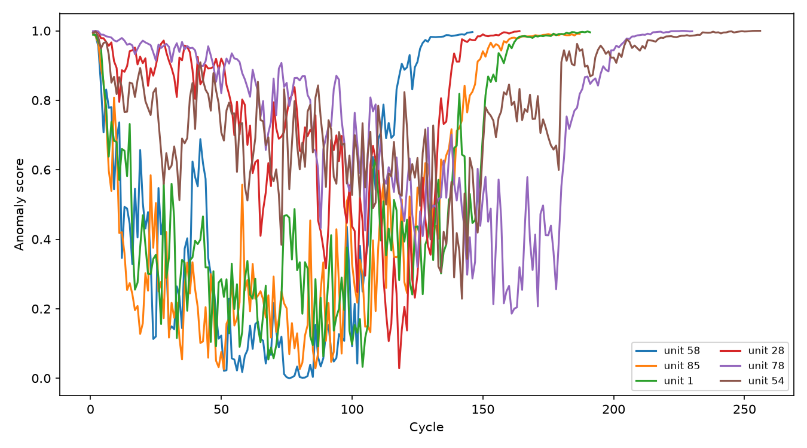

# Detecção de anomalias com Isolation Forest — FD001

## Escopo e escala

O detector foi ajustado exclusivamente no treino, em linhas com RUL>60. RUL seleciona retrospectivamente a população saudável somente durante o ajuste; ele não é feature e validation não definiu esse limite.
`raw_anomaly=-score_samples`; `anomaly_score=F_healthy(raw_anomaly)`, a CDF empírica dos raw scores saudáveis. Logo o score pertence a [0,1] e valores maiores indicam maior isolamento relativo à referência saudável. Não é probabilidade de falha, anomalia calibrada, risk_score ou health_score.

## Comportamento em validation

| Região retrospectiva | Linhas | Unidades | Média | Mediana | P95 |
| --- | ---: | ---: | ---: | ---: | ---: |
| healthy RUL>60 | 2145 | 15 | 0.527380 | 0.521903 | 0.953975 |
| near event RUL≤30 | 450 | 15 | 0.973334 | 0.989242 | 0.998992 |
| all operational | 3045 | 15 | 0.610375 | 0.621189 | 0.994790 |

## Antecedência e falsos positivos analíticos

Para tornar a mudança observável, a análise usa apenas a referência de percentil saudável 0.95 (score≥0.95). Ela não é threshold de alerta nem política operacional.

Primeiras marcações fora de RUL≤30 (indicações aparentes; não há ground truth independente de anomalia):

- unidade 96, ciclo 1, RUL retrospectivo 335, score 0.995851.
- unidade 94, ciclo 1, RUL retrospectivo 257, score 0.993632.
- unidade 54, ciclo 1, RUL retrospectivo 256, score 0.994211.
- unidade 78, ciclo 1, RUL retrospectivo 230, score 0.998939.
- unidade 89, ciclo 1, RUL retrospectivo 216, score 0.998167.
- unidade 72, ciclo 1, RUL retrospectivo 212, score 0.991413.

As primeiras marcações em ciclo 1 devem ser interpretadas com cautela: no FD001 elas podem refletir níveis iniciais entre unidades, não degradação antecipada. A sobreposição com a região saudável é evidência de que o score não deve acionar manutenção sem regra/validação adicional.

Linhas saudáveis acima dessa referência: 120 (5.59% das linhas saudáveis). Exemplos:

- unidade 78, ciclo 2, RUL retrospectivo 229, score 0.999904.
- unidade 78, ciclo 1, RUL retrospectivo 230, score 0.998939.
- unidade 28, ciclo 2, RUL retrospectivo 163, score 0.998167.
- unidade 54, ciclo 2, RUL retrospectivo 255, score 0.998167.
- unidade 78, ciclo 3, RUL retrospectivo 228, score 0.998167.
- unidade 89, ciclo 1, RUL retrospectivo 216, score 0.998167.

## Dependência e monitoramento

Isolation Forest acrescenta diversidade analítica, não um monitor independente. Ele compartilha sensores, dados de treino, preprocessing causal, partições, runtime e código de avaliação com os modelos de risco. Uma falha nesses componentes pode afetar monitor e preditor em conjunto.
O monitor pode expor valores fora da referência saudável ou deriva gradual nas features. Provavelmente não detecta falhas que preservam a distribuição das features, rotulagem incorreta, atraso de telemetria sem timestamps, nem defeitos comuns no preprocessing/runtime.
A latência de computação local é um score por observação após as janelas causais; a latência de detecção depende da frequência da telemetria e da regra futura de interpretação, inexistente nesta etapa.

## Artefatos e limites

OOF: `reports/anomaly_detection/artifacts/train_oof_anomaly_scores.parquet`. Validation: `reports/anomaly_detection/artifacts/validation_anomaly_scores.parquet`. O card, manifests, modelos, métricas por unidade e figuras ficam em `reports/anomaly_detection`.
Não foram usados test_internal, teste oficial NASA ou RUL oficial. Não há threshold operacional, fusão automática ou conversão para risco.
