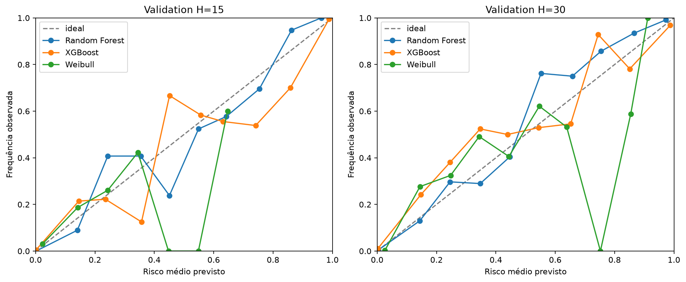
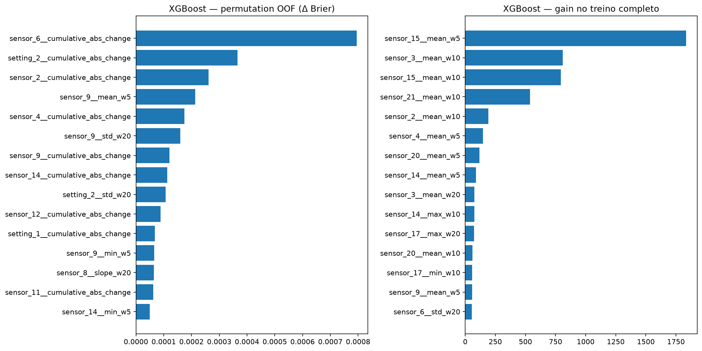
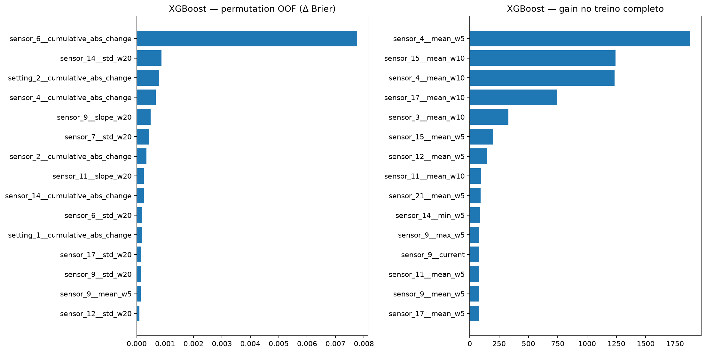

# Random Forest e XGBoost com atributos causais — FD001

## Escopo e isolamento

Modelos separados para H=15 e H=30, ajustados exclusivamente nos 70 motores de treino.
Validation contém 15 motores e é usada apenas para avaliação. Test_internal, teste oficial
NASA e RUL oficial não foram lidos. Nenhuma política operacional ou calibração foi ajustada.

## Atributos

Foram gerados 324 atributos. Janelas causais: [5, 10, 20].
Colunas constantes removidas por ajuste no treino: setting_3, sensor_1, sensor_5, sensor_10, sensor_16, sensor_18, sensor_19.
Cada janela é alinhada à direita e termina em t. Delta, diferença relativa, estatísticas móveis,
inclinação e variação absoluta acumulada reiniciam por unit_id. age_cycle é idade causal explícita.
RUL, vida normalizada, T_i, máximos de trajetória e rótulos nunca entram no schema.

## Validação cruzada agrupada

Cinco folds determinísticos por unit_id reajustam seleção, imputação e modelo. Cada motor aparece
uma vez como holdout OOF e nunca simultaneamente no ajuste do mesmo fold. O peso de cada linha
combina balanceamento por unidade e por classe.

## Comparação em validation

Precision, recall e F1 usam threshold fixo exploratório 0.5; não é threshold de alerta.

| H | Modelo | Brier | Log loss | ROC AUC | PR AUC | Precision | Recall | F1 |
| ---: | --- | ---: | ---: | ---: | ---: | ---: | ---: | ---: |
| 15 | weibull | 0.060652 | 0.197435 | 0.876394 | 0.309878 | 0.300000 | 0.066667 | 0.109091 |
| 15 | random_forest | 0.013750 | 0.043473 | 0.995992 | 0.955479 | 0.865471 | 0.857778 | 0.861607 |
| 15 | xgboost | 0.010510 | 0.034221 | 0.997762 | 0.975207 | 0.903084 | 0.911111 | 0.907080 |
| 30 | weibull | 0.098197 | 0.293576 | 0.882405 | 0.484177 | 0.527473 | 0.213333 | 0.303797 |
| 30 | random_forest | 0.026506 | 0.098489 | 0.989627 | 0.954507 | 0.924390 | 0.842222 | 0.881395 |
| 30 | xgboost | 0.022978 | 0.078590 | 0.994328 | 0.969911 | 0.923990 | 0.864444 | 0.893226 |

Métricas por linha têm dependência intraunidade; o artefato por unidade deve ser consultado.
Os horizontes têm prevalências diferentes e não devem ser ranqueados entre si por Brier/log loss.

## Features mais relevantes

### H=15

Permutation OOF: sensor_6__cumulative_abs_change (0.000795511), setting_2__cumulative_abs_change (0.000365218), sensor_2__cumulative_abs_change (0.000261169), sensor_9__mean_w5 (0.00021343), sensor_4__cumulative_abs_change (0.000174712), sensor_9__std_w20 (0.000159489), sensor_9__cumulative_abs_change (0.000120733), sensor_14__cumulative_abs_change (0.000113027), setting_2__std_w20 (0.000107555), sensor_12__cumulative_abs_change (8.89063e-05)

Gain XGBoost: sensor_15__mean_w5 (1834.41), sensor_3__mean_w10 (809.124), sensor_15__mean_w10 (795.036), sensor_21__mean_w10 (537.428), sensor_2__mean_w10 (191.736), sensor_4__mean_w5 (147.126), sensor_20__mean_w5 (117.526), sensor_14__mean_w5 (88.2523), sensor_3__mean_w20 (76.4311), sensor_14__max_w10 (74.8647)

### H=30

Permutation OOF: sensor_6__cumulative_abs_change (0.00775748), sensor_14__std_w20 (0.000872487), setting_2__cumulative_abs_change (0.000795405), sensor_4__cumulative_abs_change (0.000670781), sensor_9__slope_w20 (0.000490998), sensor_7__std_w20 (0.000444774), sensor_2__cumulative_abs_change (0.000345712), sensor_11__slope_w20 (0.000255441), sensor_14__cumulative_abs_change (0.000250215), sensor_6__std_w20 (0.000183256)

Gain XGBoost: sensor_4__mean_w5 (1878.8), sensor_15__mean_w10 (1243.84), sensor_4__mean_w10 (1233.56), sensor_17__mean_w10 (743.473), sensor_3__mean_w10 (328.872), sensor_15__mean_w5 (199.181), sensor_12__mean_w5 (146.117), sensor_11__mean_w10 (97.3385), sensor_21__mean_w5 (91.1876), sensor_14__min_w5 (85.2115)

A importância por permutação usa holdouts OOF e Δ Brier; gain usa o ajuste final do treino.
Features correlacionadas dividem importância e nenhuma medida implica causalidade física.

## Coerência entre horizontes

{"evaluated": true, "by_algorithm": {"random_forest": {"short_horizon": 15, "long_horizon": 30, "violations_short_greater_than_long": 11, "fraction": 0.00361247947454844, "maximum_violation": 0.0061145213838790236}, "xgboost": {"short_horizon": 15, "long_horizon": 30, "violations_short_greater_than_long": 38, "fraction": 0.012479474548440065, "maximum_violation": 0.0003310214960947633}}}

Modelos separados não impõem p(H=15) ≤ p(H=30); violações são registradas, não corrigidas
por pós-processamento nesta etapa.

## Leakage auditado

O schema proíbe campos retrospectivos. Testes por prefixo demonstram que alterar ou anexar
ciclos futuros não muda atributos já emitidos. Folds não compartilham unidades e cada fold
reajusta seleção/imputação. A permutation importance não usa validation.

Limite: mediana global de imputação é estado aprendido no treino do fold, não informação online
do ativo. age_cycle pode funcionar como atalho populacional por idade e é mantido explícito.

## Dependências compartilhadas

Random Forest e XGBoost compartilham dados, split, alvos, gerador de features, imputação, runtime
e avaliação. Uma falha comum nesses componentes pode afetar ambos; diversidade de algoritmo
não constitui redundância independente. Concordância não prova correção.

## Artefatos

- OOF de treino: `reports/classical_ml/artifacts/train_oof_predictions.parquet`.
- Previsões de validation: `reports/classical_ml/artifacts/validation_predictions.parquet`.
- Métricas por unidade: `reports/classical_ml/artifacts/metrics_by_unit.parquet`.
- Model cards: `reports/classical_ml/random_forest_model_card.json` e `xgboost_model_card.json`.
- Modelos finais: `reports/classical_ml/artifacts/models`.
- Importâncias: Parquets em `reports/classical_ml/artifacts`.

## Limitações

Probabilidades não receberam calibração adicional; threshold 0,5 é apenas diagnóstico.
Validation já integra o ciclo de desenvolvimento e não é evidência final. Resultados FD001
não demonstram desempenho industrial, independência entre modelos ou benefício de manutenção.
