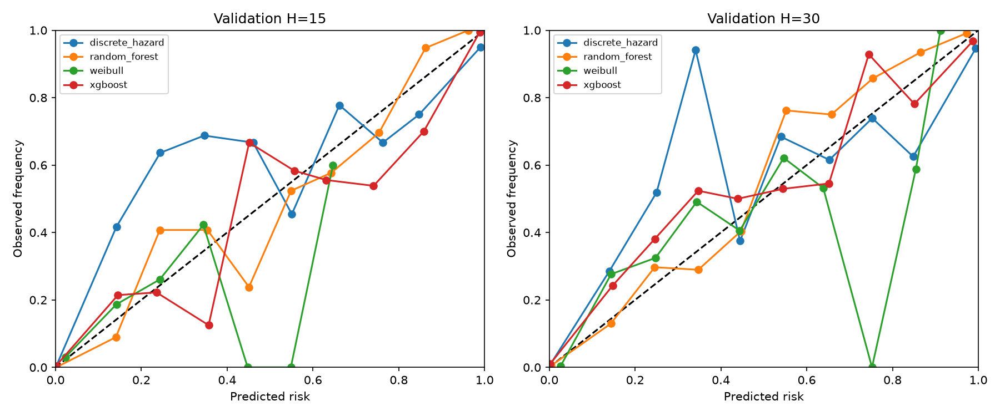
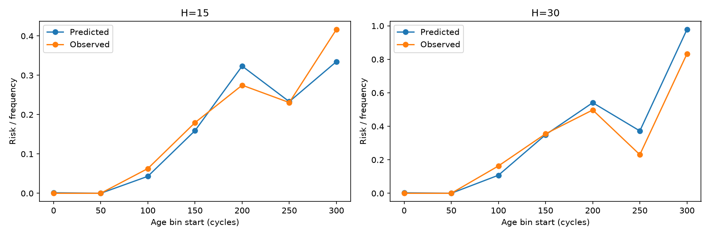

# Hazard discreto logístico — FD001

## Construção landmark

Cada origem operacional t recebe passos k=1..30, com covariáveis congeladas em t, idade t e k/30. A máscara inclui k≤observed_end−t. O alvo vale 1 somente em k=T−t com evento observado. Não há linhas após evento; após censura os passos não entram na perda. Nenhuma censura foi fabricada no FD001.

logit(h)=b0+bᵀz(x_t,t)+bk(k/30). Padronização, seleção de constantes e imputação são aprendidas somente no treino de cada fold. A perda Bernoulli soma passos observados com penalização L2, sem balancear classes. A implementação fatorada é equivalente a expandir as linhas, evitando duplicar toda a matriz.

324 features causais; resumo do ajuste: `{"origins": 14564, "landmark_steps": 406470, "event_steps": 2100, "units": 70, "iterations": 1143, "converged": true, "objective": 5659.631462696982, "optimizer_message": "CONVERGENCE: RELATIVE REDUCTION OF F <= FACTR*EPSMCH", "weighting": "equal observed landmark-step; no class balancing or resampling"}`.

Landmarks sobrepostos são dependentes e formam uma verossimilhança composta. Motores longos contribuem mais passos; não se calculam erros-padrão iid. A avaliação por unidade acompanha a avaliação por linha. Cinco folds usam seed 4302, igual aos modelos clássicos, sem unidades compartilhadas dentro do fold.

## Comparação em validation

| H | Modelo | Brier | Log loss | ROC AUC | PR AUC/AP | Previsto | Observado |
| --- | --- | --- | --- | --- | --- | --- | --- |
| 15 | discrete_hazard | 0.015063 | 0.047818 | 0.996331 | 0.953002 | 0.068471 | 0.073892 |
| 15 | random_forest | 0.013750 | 0.043473 | 0.995992 | 0.955479 | 0.074514 | 0.073892 |
| 15 | weibull | 0.060652 | 0.197435 | 0.876394 | 0.309878 | 0.068597 | 0.073892 |
| 15 | xgboost | 0.010510 | 0.034221 | 0.997762 | 0.975207 | 0.072751 | 0.073892 |
| 30 | discrete_hazard | 0.027172 | 0.111344 | 0.991002 | 0.956559 | 0.141744 | 0.147783 |
| 30 | random_forest | 0.026506 | 0.098489 | 0.989627 | 0.954507 | 0.139792 | 0.147783 |
| 30 | weibull | 0.098197 | 0.293576 | 0.882405 | 0.484177 | 0.135551 | 0.147783 |
| 30 | xgboost | 0.022978 | 0.078590 | 0.994328 | 0.969911 | 0.140072 | 0.147783 |

## Calibração e coerência

As curvas usam dez bins de probabilidade. Calibração por idade usa faixas fixas de 50 ciclos, sem vida normalizada ou seleção de features por validation. Contagens por faixa e unidade estão em Parquet. Faixas de uma classe têm ranking indefinido (null). Oscilações em bins pequenos não sustentam conclusões industriais.

Coerência observada: `{"train_oof": {"origins": 14564, "violations": 0}, "validation": {"origins": 3045, "violations": 0}}`. O mesmo modelo gera ambos os horizontes, logo S(H)=produto(1-h) não aumenta e risco não diminui com H. Isso não garante calibração nem monotonicidade em idade.

## Limitações e assurance

ASM016–018 permanecem abertas: adequação do logit aditivo, suficiência das features e contribuição dos landmarks. ASM011 (censura condicionalmente não informativa) não foi confirmada por fixtures. Weibull continua baseline cuja aderência foi rejeitada. RF/XGB e hazard compartilham dados, features, folds, runtime e avaliação: não são redundância independente. Não há calibração posterior, threshold ou política de manutenção.

Treino e validation apenas; test_internal e teste oficial não utilizados. Comparações reutilizam previsões históricas alinhadas por chave e horizonte, sem reajustar os modelos anteriores. A avaliação repetida em validation não é avaliação final.

## Artefatos e reprodução

`reports/discrete_hazard/artifacts/train_oof_predictions.parquet`, `validation_predictions.parquet`, `metrics_by_unit.parquet`, `calibration_by_age.parquet`, `fold_manifest.json`, modelos e preprocessors por fold e finais. Card em `reports/discrete_hazard/model_card.json`; métricas em `metrics.json`.

Executar: `.venv/Scripts/python.exe -m predictive_maintenance.application.discrete_hazard_fd001`. Artefatos joblib somente de fonte local confiável. Os horizontes 15/30 são experimentais.
