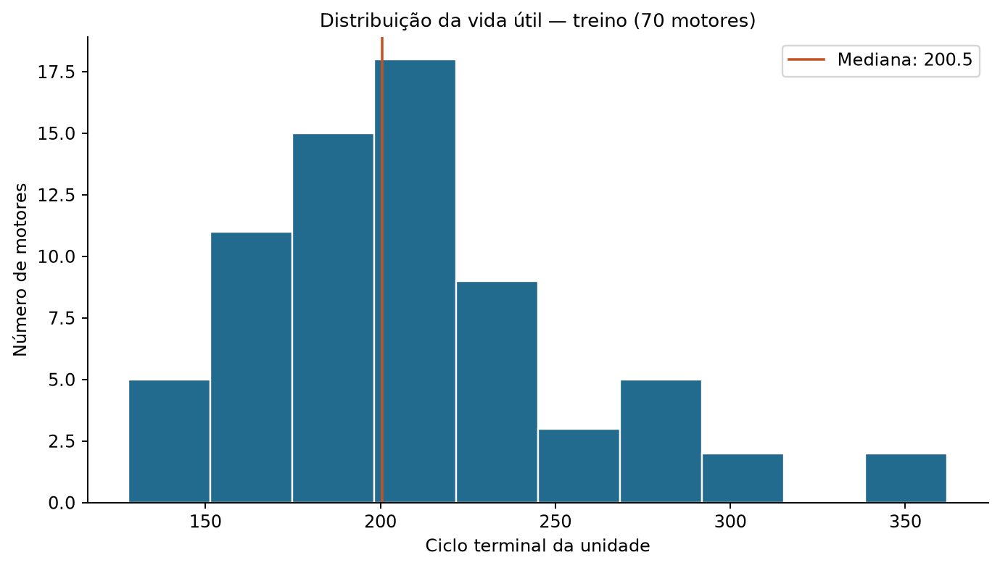
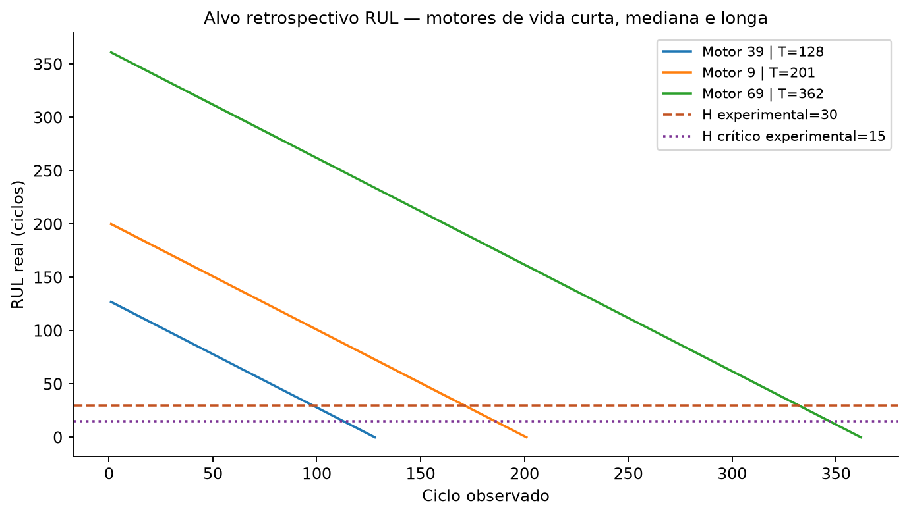
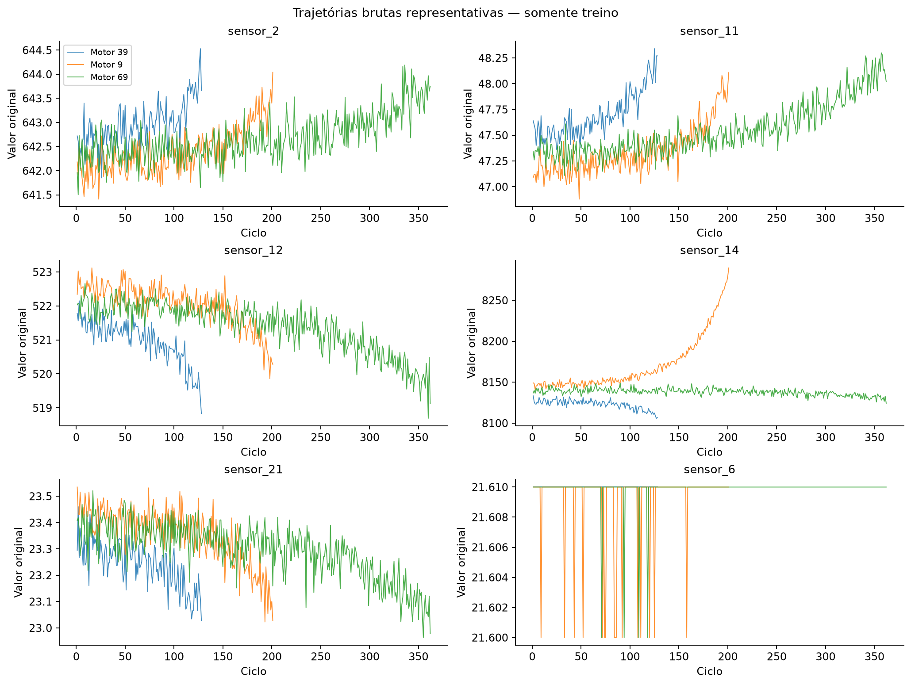
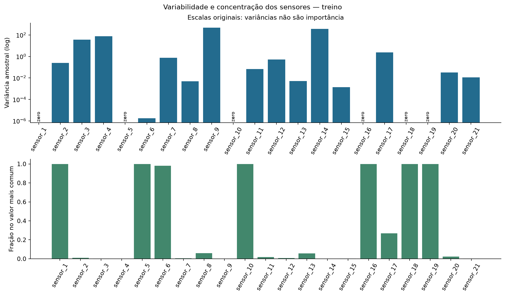
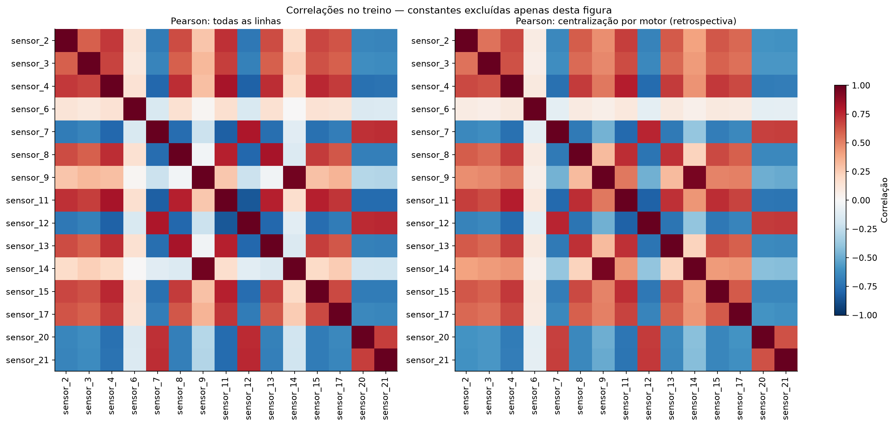
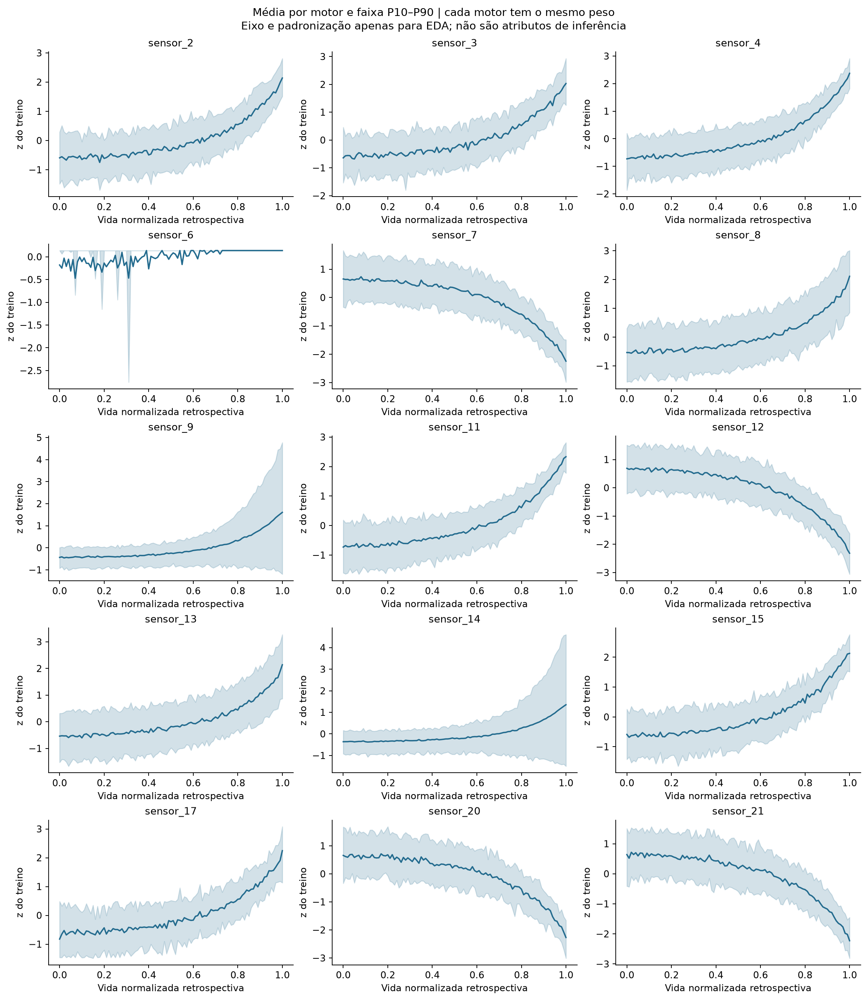
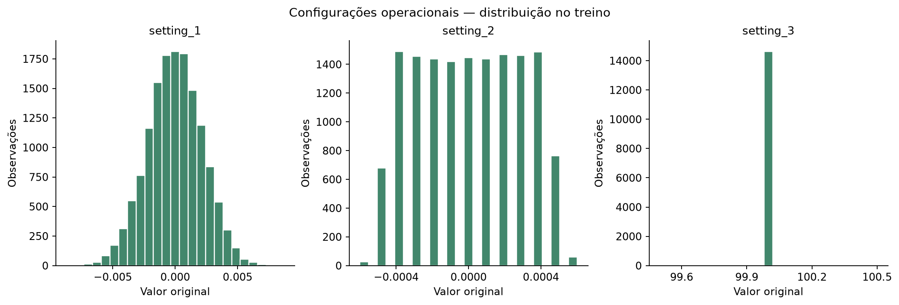
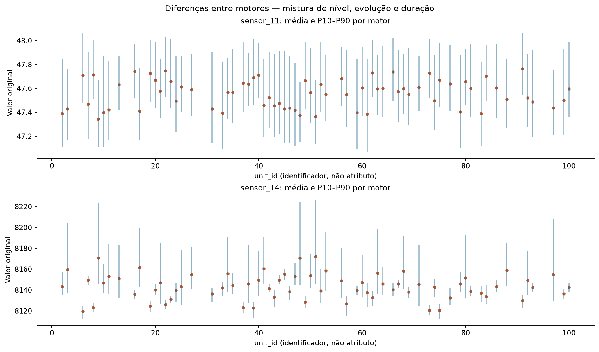

# EDA do C-MAPSS FD001 e definição do problema

## Escopo e origem dos dados

Análise descritiva exclusivamente de `train.parquet`: **70 motores
e 14634 observações**. Não confundir esse treino interno com os 100
motores do treino original da NASA. Desenvolvimento significa treino + validação;
ambos recebem alvos separados, mas somente o treino entra em estatísticas,
figuras, heurísticas e candidatos de sensores.

Entradas: `data/processed/fd001/train.parquet`, `validation.parquet` (somente
validação de chaves e criação de alvos), `split_manifest.json` e
`configs/fd001_eda.toml`. Nenhum arquivo em `data/raw`, nenhum Parquet de teste
interno e nenhum teste oficial foi lido nesta execução. Os hashes de entradas,
versões e configuração estão em [summary.json](eda/summary.json).

Os Parquets originais são preservados. Os alvos ficam em
`data/processed/fd001/evaluation_targets/train_targets.parquet` e
`validation_targets.parquet`, acompanhados de `metadata.json`.

## Distribuição da duração

| Medida no treino interno | Ciclos |
| --- | ---: |
| Mínimo | 128 |
| Quartil 25% | 180.25 |
| Mediana | 200.5 |
| Média | 209.06 |
| Quartil 75% | 230.75 |
| Máximo | 362 |
| Desvio padrão | 47.03 |

Há durações heterogêneas entre motores. Observações de um mesmo motor são
dependentes; juntar todas as linhas dá mais peso a motores de vida longa.
A distribuição acima atribui uma observação a cada motor.

## Variância, sensores informativos e candidatos à remoção

| Sensor | Mínimo | Máximo | Variância | Valores únicos | Valor dominante | ρ mediano por motor | Direção concordante |
| --- | ---: | ---: | ---: | ---: | ---: | ---: | ---: |
| sensor_1 | 518.67 | 518.67 | 0 | 1 | 100.00% | indefinido | indefinido |
| sensor_2 | 641.21 | 644.53 | 0.24689 | 304 | 1.03% | 0.66602 | 1 |
| sensor_3 | 1571 | 1616.9 | 37.37 | 2821 | 0.14% | 0.62825 | 1 |
| sensor_4 | 1385.8 | 1439 | 78.445 | 3752 | 0.10% | 0.78216 | 1 |
| sensor_5 | 14.62 | 14.62 | 0 | 1 | 100.00% | indefinido | indefinido |
| sensor_6 | 21.6 | 21.61 | 1.8177e-06 | 2 | 98.15% | 0.13063 | 0.97778 |
| sensor_7 | 549.85 | 556.06 | 0.76964 | 497 | 0.60% | -0.7689 | 1 |
| sensor_8 | 2387.9 | 2388.6 | 0.0049661 | 52 | 5.91% | 0.7637 | 1 |
| sensor_9 | 9021.7 | 9244.6 | 488.08 | 5619 | 0.10% | 0.75909 | 0.74286 |
| sensor_10 | 1.3 | 1.3 | 0 | 1 | 100.00% | indefinido | indefinido |
| sensor_11 | 46.86 | 48.52 | 0.069386 | 155 | 1.76% | 0.81409 | 1 |
| sensor_12 | 518.69 | 523.38 | 0.53513 | 416 | 0.70% | -0.79214 | 1 |
| sensor_13 | 2387.9 | 2388.6 | 0.0050547 | 53 | 5.79% | 0.7546 | 1 |
| sensor_14 | 8102.8 | 8293.7 | 364.64 | 5347 | 0.09% | 0.67299 | 0.61429 |
| sensor_15 | 8.3279 | 8.5848 | 0.0013867 | 1830 | 0.19% | 0.71905 | 1 |
| sensor_16 | 0.03 | 0.03 | 0 | 1 | 100.00% | indefinido | indefinido |
| sensor_17 | 388 | 400 | 2.3734 | 13 | 26.94% | 0.66086 | 1 |
| sensor_18 | 2388 | 2388 | 0 | 1 | 100.00% | indefinido | indefinido |
| sensor_19 | 100 | 100 | 0 | 1 | 100.00% | indefinido | indefinido |
| sensor_20 | 38.14 | 39.43 | 0.032281 | 115 | 2.36% | -0.69952 | 1 |
| sensor_21 | 22.907 | 23.613 | 0.011659 | 4384 | 0.14% | -0.69578 | 1 |

Exatamente constantes: **sensor_1, sensor_5, sensor_10, sensor_16, sensor_18, sensor_19**.
Quase constantes pela heurística exploratória: **sensor_6**.
Critério de quase constância: até 2 valores e
fração dominante de pelo menos 95%.
Esses critérios são configuráveis, escolhidos para triagem e não comprovam
irrelevância preditiva. Uma constante é identificada por um único valor;
variâncias residuais de arredondamento numérico são exibidas como zero.

Candidatos à remoção futura, **sem remoção nesta etapa**:
sensor_1, sensor_5, sensor_10, sensor_16, sensor_18, sensor_19, sensor_6. O `sensor_6` merece revisão separada: baixa amplitude e
concentração não excluem um evento raro informativo. A perda de desempenho
deverá ser investigada depois por ablação em partições por unidade internas
ao treino. Decisões de seleção continuam restritas ao treino; validação externa
fica reservada para avaliação e definição dos alertas.

Tendências associadas ao envelhecimento: sensor_2, sensor_3, sensor_4, sensor_7, sensor_8, sensor_11, sensor_12, sensor_13, sensor_15, sensor_17, sensor_20, sensor_21.
Os cinco maiores valores absolutos de ρ mediano nesse grupo são:
sensor_11, sensor_12, sensor_4, sensor_7, sensor_8. São candidatos descritivos, não variáveis selecionadas
por desempenho. Nenhum modelo ou teste de significância foi ajustado.

Para cada sensor, calculou-se a correlação de Spearman entre valor e ciclo
**dentro de cada motor**, seguida de mediana e concordância de sinal entre
motores (peso igual por unidade). ρ é Pearson dos ranks. A triagem de tendência
usa |ρ mediano| ≥ 0.5 e concordância
≥ 80%. Correlação indefinida em unidades
constantes é excluída dessa mediana; a quantidade de unidades válidas está no JSON.
Sinal positivo indica crescimento com idade, sinal negativo queda.

Os sensores 9 e 14 têm tendências menos consistentes entre motores:
concordâncias de sinal de 74.3% e
61.4%, respectivamente.
Ambos continuam disponíveis e não são candidatos à remoção por esse critério.
A média normalizada pode esconder unidades com trajetórias em sentido oposto.

## Configurações operacionais e escalas

| Configuração | Mínimo | Máximo | Desvio padrão | Valores únicos |
| --- | ---: | ---: | ---: | ---: |
| setting_1 | -0.0087 | 0.0087 | 0.00219861 | 155 |
| setting_2 | -0.0006 | 0.0006 | 0.000295211 | 13 |
| setting_3 | 100 | 100 | 0 | 1 |

`setting_3` é constante nesta amostra de treino; as outras configurações têm
variação em torno dos valores registrados acima. Elas não foram removidas.
Não se infere capacidade de generalização para outros regimes operacionais
apenas deste subconjunto.

Os sensores têm escalas muito diferentes. Variância absoluta não mede
importância: um sensor na escala de milhares pode dominar distâncias, perdas
ou penalizações quando combinado com sensores de pequena amplitude.
Qualquer normalizador futuro deverá ser ajustado apenas no treino. A
padronização exibida nas curvas normalizadas é apenas visual e usa média e
desvio padrão do treino; não foi exportada como engenharia de atributos.

## Correlações e diferenças entre motores

| Par | Pearson agregado | Pearson centralizado por motor |
| --- | ---: | ---: |
| sensor_9 / sensor_14 | 0.964 | 0.949 |
| sensor_11 / sensor_12 | -0.844 | -0.807 |
| sensor_4 / sensor_11 | 0.826 | 0.788 |
| sensor_8 / sensor_13 | 0.821 | 0.731 |
| sensor_7 / sensor_11 | -0.819 | -0.775 |
| sensor_4 / sensor_12 | -0.811 | -0.772 |

Correlações altas sugerem redundância, mas podem refletir envelhecimento
compartilhado ou níveis diferentes entre motores; não estabelecem causalidade.
A segunda coluna de coeficientes retira a média de cada motor para mostrar
essa sensibilidade. Essa centralização usa toda a trajetória e é exclusivamente
retrospectiva. Sensores constantes são excluídos apenas das matrizes, pois sua
correlação é indefinida. As duas figuras abrangem todos os sensores variáveis.

| Sensor | DP das médias dos motores | Mediana do DP dentro do motor |
| --- | ---: | ---: |
| sensor_11 | 0.11824 | 0.22887 |
| sensor_14 | 12.284 | 6.9626 |
| sensor_6 | 0.00022837 | 0.00075838 |

As diferenças de nível e dispersão entre motores coexistem com diferenças
de duração e estágio de degradação. Desvio entre médias não isola um efeito
causal do motor. Os gráficos brutos mostram motores de vida curta, mediana e
longa escolhidos deterministicamente no treino, sem usar resultados de teste.

## Evolução em função da vida normalizada

Para cada unidade, a vida normalizada é `(cycle - 1) / (T_i - 1)`.
Interpolação linear em 101 posições entre 0 e 1 permite calcular a
média entre motores, com **igual peso por motor**, e a faixa P10–P90.
A faixa mostra dispersão entre trajetórias, não intervalo de confiança.
Esse eixo revela tendências médias e dispersão que as trajetórias individuais
podem ocultar. Os trechos iniciais/finais dependem da composição desta amostra.
Nas curvas deste treino, o crescimento dos sensores 2, 4, 11 e 15 e a queda
dos sensores 7, 12, 20 e 21 se acentuam perto do término; isso é evidência
descritiva de envelhecimento, não demonstração de desempenho preditivo.

O ciclo terminal T_i é conhecido somente retrospectivamente. Vida normalizada,
interpolação com pontos futuros e médias por trajetória completa **não podem
entrar nos atributos de inferência**.

## Definição formal dos alvos e do risco

Para a unidade i observada no ciclo t, seja T_i o ciclo terminal de falha,
assumindo trajetória completa até a falha neste estudo de caso:

- `RUL(i,t) = T_i - t`, em ciclos, inteiro não negativo e sem truncamento.
- `failure_within_horizon(i,t) = 1[RUL(i,t) <= H]`.
- `failure_within_critical_horizon(i,t) = 1[RUL(i,t) <= H_critical]`.

Configuração atual: **H=30 ciclos** e **H_critical=15 ciclos**.
Ambos são parâmetros experimentais configuráveis; **não são regras
industriais, limites de segurança nem thresholds de alerta**.

A fronteira é inclusiva: RUL=H é positivo, RUL=H+1 é negativo.
No ciclo terminal RUL=0, os dois alvos são verdadeiros; esse registro é
preservado para avaliação retrospectiva. `is_operational = (RUL > 0)` identifica
o subconjunto a usar para futuros alertas prospectivos. Incluir o ciclo da falha
em métricas de antecipação pode inflar artificialmente o desempenho.

No treino há 2170 positivos em 14634 linhas para H=30
(14.83%) e 1120 para H=15
(7.65%). Excluindo os ciclos terminais, há
2100 e 1050
positivos, respectivamente, em 14564 linhas operacionais.
Essas proporções evidenciam desbalanceamento de classes e dependência temporal.

O objetivo principal futuro é estimar
`p_H(i,t) = P(0 < T_i-t <= H | T_i > t, histórico disponível até t)`.
Isso é risco de falha em uma janela futura para um ativo ainda operacional,
não regressão de RUL, nem taxa instantânea de falha. RUL é preservado como
variável de avaliação para erro em ciclos, antecedência e estratificação.
O alvo binário conhecido retrospectivamente não é um escore predito.
Futuramente, o mesmo histórico deve satisfazer p_critical ≤ p_H; calibração
e coerência dos horizontes precisarão ser verificadas.

O máximo observado de uma sequência censurada não é uma falha. Esta função
de alvos exige confirmação explícita de trajetória completa; não deverá ser
aplicada ao teste oficial truncado, nem a ativos em serviço, sem tratamento de
censura ou referência de desfecho apropriada.

## Vazamento de informação e avaliação futura

- Alvos, RUL real, ciclo terminal, vida normalizada e `is_operational` ficam
  separados da telemetria; não são atributos de um futuro modelo.
- Seleção, remoção, estatísticas, correlações e normalização visual usam
  somente treino. Validação foi lida apenas para chaves e alvos.
- Teste interno e teste oficial permanecem reservados. Não escolher sensores,
  horizontes ou thresholds com base neles.
- Separar por motor; janelas do mesmo motor não podem atravessar partições.
- Filtros, janelas e atributos futuros só podem usar ciclos até t. Evitar
  janelas centradas, normalização por trajetória completa e suavização futura.
- `unit_id` é chave, não variável explicativa. `cycle` é conhecido no instante,
  mas pode induzir atalhos de idade que exigirão comparação e validação.
- H foi definido experimentalmente, sem otimização por resultado de teste.
  Repetir muitas decisões no mesmo conjunto de validação também pode gerar
  sobreajuste de desenvolvimento.

## Como será definido o alerta

| Nível futuro | Significado conceitual |
| --- | --- |
| normal | Monitoramento de rotina, sem evidência suficiente para escalada. |
| atenção | Evidência inicial ou incerta; acompanhar evolução e qualidade dos dados. |
| alerta | Risco no horizonte principal que justifique planejar inspeção ou manutenção. |
| crítico | Risco no horizonte curto que justifique priorizar avaliação/intervenção. |

Nenhum threshold definitivo, regra de score ou nível por observação foi criado.
Os níveis deverão usar probabilidades calibradas, incerteza, persistência
temporal, custo de alarmes e consequências da falha. Não confundir H com um
limiar numérico de probabilidade.

A definição futura será feita com métricas de validação: precisão/recall e
PR-AUC, calibração/Brier, falsos alarmes por motor ou exposição, cobertura de
falhas, antecedência em ciclos e utilidade/custos. Avaliar no nível de evento e
unidade, não apenas por linha. Somente após congelar essas escolhas será
permitida a avaliação final em teste. Os quatro níveis não são recomendações
industriais validadas.

## Figuras

### Distribuição da vida útil

### RUL ao longo do tempo

### Trajetórias representativas

### Variância e concentração

### Correlações

### Evolução média em vida normalizada

### Configurações operacionais

### Diferenças entre motores

## Reprodução

Executar na raiz: `.venv/Scripts/python.exe -m predictive_maintenance.application.eda_fd001`.
Código reutilizável em `src/predictive_maintenance/analysis` e `data/targets.py`; nenhum modelo é treinado. Os horizontes são salvos junto aos alvos para evitar ambiguidade quando a configuração mudar.
