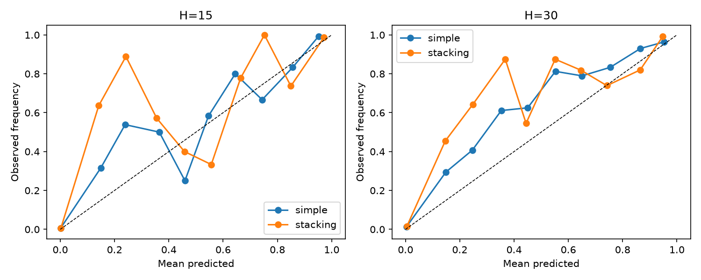
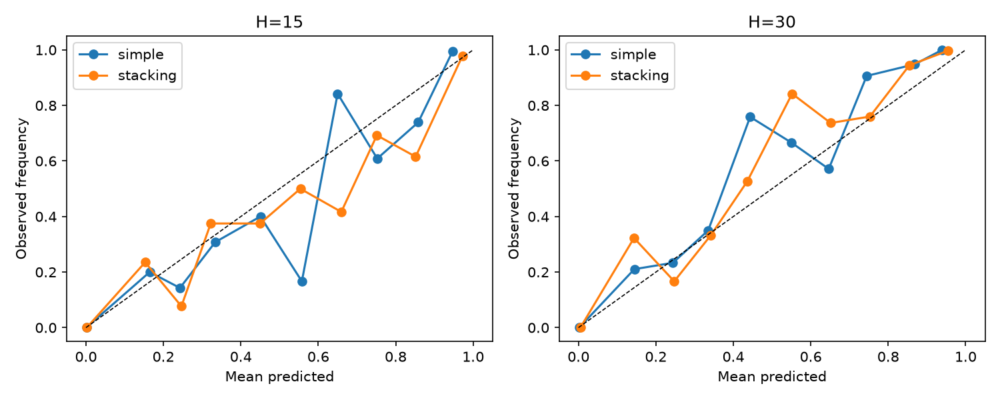

# Fusão probabilística e política inicial de alertas — FD001

## Protocolo sem leakage

RF, XGBoost e hazard usam previsões OOF existentes; a Weibull é reajustada dentro de cada fold por unidade. O stacking logístico é treinado apenas nessas previsões OOF. Sua saída de treino é novamente cross-fitted por `unit_id`. Platt e isotonic são comparados por cross-fitting agrupado; o calibrador final aprende apenas de scores cross-fitted. Validation escolhe thresholds depois de modelos e calibradores congelados. `test_internal` é aberto uma única vez após o manifesto de freeze.

O ensemble simples é a média das quatro probabilidades comparáveis. `anomaly_score` entra somente como covariável do stacking e mantém semântica de anormalidade. `disagreement=max(risk)-min(risk)` entre os quatro riscos; é divergência entre modelos, não intervalo de confiança.

## Auditoria OOF

Foram alinhadas 14564 origens de 70 unidades por horizonte no treino e 3045 origens de 15 unidades por horizonte em validation. Ausências alinhadas: 0; chaves duplicadas: 0.

Platt foi selecionado para ensemble simples e stacking em H15/H30 porque apresentou o menor log loss cross-fitted entre Platt e isotonic; a opção sem calibração permaneceu referência. Isotonic obteve Brier ligeiramente menor em alguns casos, mas gerou extremos 0/1 e log loss pior.

## Calibração e métricas por linha

### train_oof

| Método | H | Brier | Log loss | ROC AUC | PR AUC | Precision | Recall | F1 |
| --- | ---: | ---: | ---: | ---: | ---: | ---: | ---: | ---: |
| simple | 15 | 0.012284 | 0.040960 | 0.996176 | 0.953593 | nan | nan | nan |
| simple | 30 | 0.023429 | 0.082669 | 0.991161 | 0.944886 | nan | nan | nan |
| stacking | 15 | 0.011370 | 0.039400 | 0.996946 | 0.960201 | nan | nan | nan |
| stacking | 30 | 0.022048 | 0.078532 | 0.992883 | 0.960779 | nan | nan | nan |

### validation

| Método | H | Brier | Log loss | ROC AUC | PR AUC | Precision | Recall | F1 |
| --- | ---: | ---: | ---: | ---: | ---: | ---: | ---: | ---: |
| simple | 15 | 0.013720 | 0.045925 | 0.996635 | 0.962220 | 0.845833 | 0.902222 | 0.873118 |
| simple | 30 | 0.028400 | 0.109615 | 0.986460 | 0.929686 | 0.855346 | 0.906667 | 0.880259 |
| stacking | 15 | 0.012694 | 0.043651 | 0.997760 | 0.973083 | 0.890351 | 0.902222 | 0.896247 |
| stacking | 30 | 0.025415 | 0.097943 | 0.988694 | 0.960961 | 0.922374 | 0.897778 | 0.909910 |

### test_internal

| Método | H | Brier | Log loss | ROC AUC | PR AUC | Precision | Recall | F1 |
| --- | ---: | ---: | ---: | ---: | ---: | ---: | ---: | ---: |
| simple | 15 | 0.010307 | 0.033448 | 0.997873 | 0.975697 | 0.789286 | 0.982222 | 0.875248 |
| simple | 30 | 0.016619 | 0.057350 | 0.997215 | 0.985302 | 0.850288 | 0.984444 | 0.912461 |
| stacking | 15 | 0.010178 | 0.033190 | 0.998148 | 0.979309 | 0.805861 | 0.977778 | 0.883534 |
| stacking | 30 | 0.013538 | 0.049782 | 0.998065 | 0.989777 | 0.878244 | 0.977778 | 0.925342 |

## Coerência entre horizontes

| Partição | Origens | Violações p15>p30 | Fração | Excesso máximo |
| --- | ---: | ---: | ---: | ---: |
| train_oof | 14564 | 705 | 4.8407% | 0.071125 |
| validation | 3045 | 141 | 4.6305% | 0.063214 |
| test_internal | 2922 | 160 | 5.4757% | 0.045707 |

Os modelos e calibradores são separados por horizonte, por isso a coerência não é garantida. As violações permanecem visíveis; nenhuma correção pós-teste foi aplicada.

## Política inicial

Thresholds validation: atenção=0.006568 em H30; alerta=0.158112 em H30; crítico=0.201375 em H15. Um nível é emitido após 3 ciclos consecutivos. São parâmetros experimentais do demonstrador, não limites aeronáuticos reais.

Métricas por unidade incluem primeiro alerta, antecedência, episódios/duração de falsos alertas, persistência, maior sequência e fração de vida. Os Parquets ficam em `reports/fusion/artifacts/*_metrics_by_unit.parquet`.

## Estados e dependências

Com todos os componentes válidos, a saída é `valid`. A média simples pode operar como `degraded` com ao menos dois riscos comparáveis; o stacking exige todas as covariáveis e fica `unavailable` se uma faltar. Entrada inválida ou antiga torna a saída indisponível; ausência nunca vira risco zero.

Telemetria, preprocessing, features, treino, alvo, runtime, horizonte, thresholds e serialização são dependências comuns. A diversidade algorítmica não sustenta alegação de independência.

## Resumo temporal por unidade

| Partição | H | Unidades alertadas | Lead time mediano | Lead time mínimo | Episódios falsos | Duração falsa total | Fração média da vida sob alerta |
| --- | ---: | ---: | ---: | ---: | ---: | ---: | ---: |
| validation | 15 | 15 | 12.0 | 8.0 | 8 | 25 | 7.6487% |
| validation | 30 | 15 | 26.0 | 19.0 | 7 | 34 | 14.5501% |
| test_internal | 15 | 15 | 17.0 | 11.0 | 13 | 53 | 9.5276% |
| test_internal | 30 | 15 | 32.0 | 24.0 | 15 | 61 | 17.5158% |

Avaliação congelada: `test_internal`, 2937 linhas brutas, 15 unidades, 5844 previsões H15/H30, uma leitura registrada. Nenhum resultado foi usado para nova seleção.
