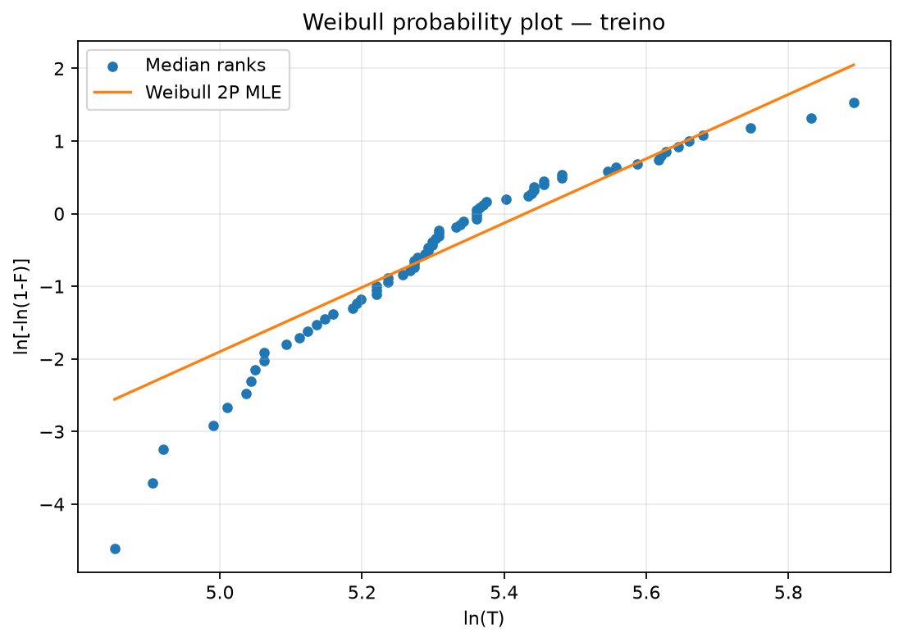
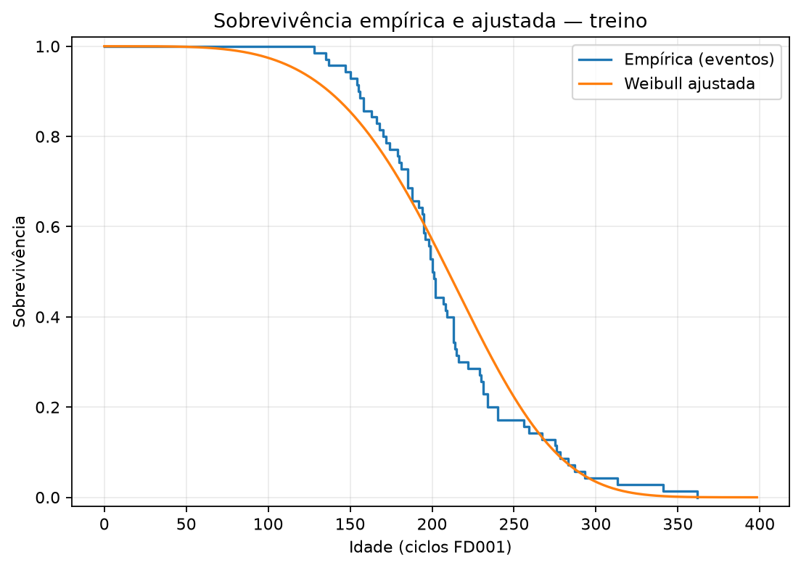
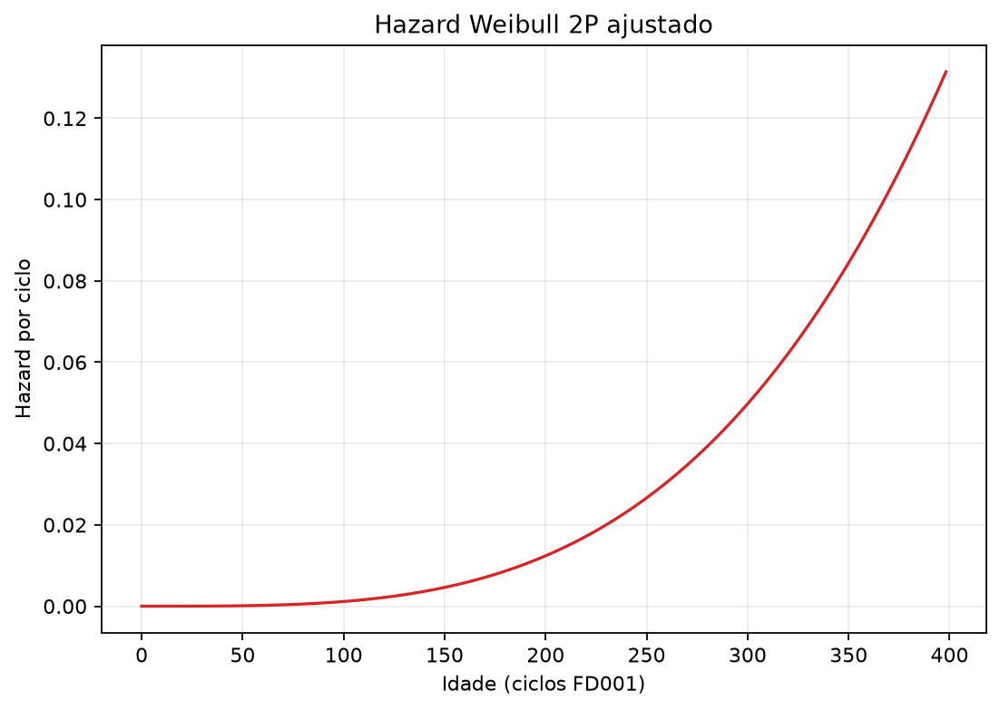
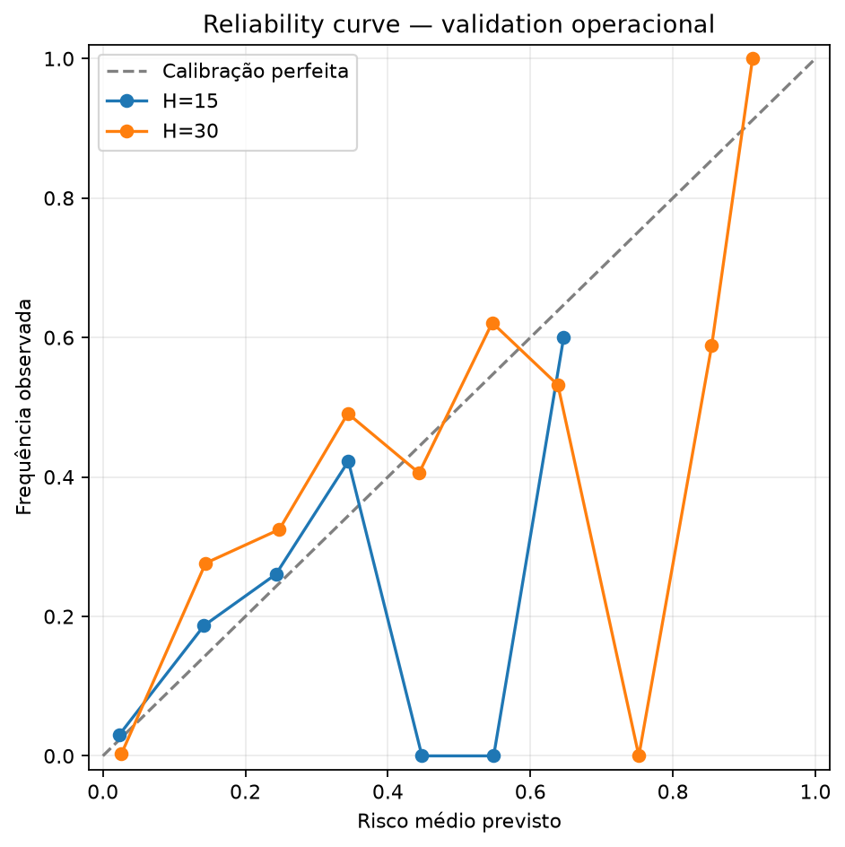
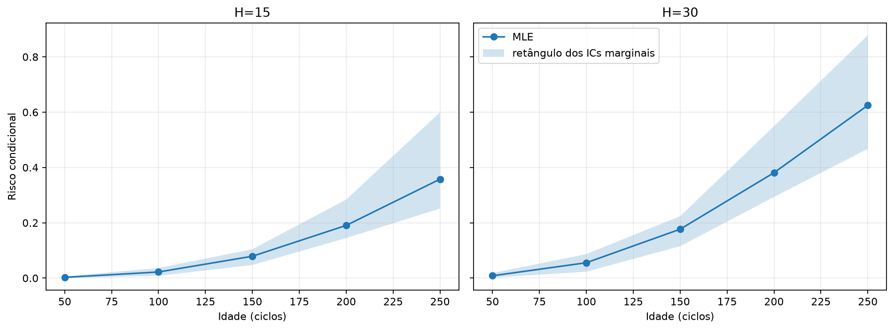

# Baseline populacional Weibull 2P — FD001

## Escopo

Weibull de dois parâmetros com localização fixa em zero, ajustada por máxima
verossimilhança a uma duração T_i por cada um dos 70 motores de treino.
Todas as durações são eventos observados. Nenhum sensor, unidade de validation
ou holdout participa do ajuste. É um baseline estatístico por idade; não é modelo
físico automático de degradação. Nenhum threshold foi escolhido.

## Parâmetros e incerteza

| Parâmetro | MLE | IC bootstrap 95% |
| --- | ---: | ---: |
| beta | 4.428466 | [3.860107, 5.670466] |
| eta (ciclos) | 227.987974 | [215.252370, 241.177970] |

IC percentil não paramétrico com 2000 reamostragens dos 70 motores inteiros, seed 4201; ciclos não foram reamostrados como independentes.

## Aderência no treino

Cramér–von Mises W²=0.345778; valor crítico bootstrap a 5%=0.122799; p=0.000500 (erro-padrão Monte Carlo aproximado 0.000500). Decisão: `reject`.
Foram usadas 2000 amostras paramétricas, seed 4202; cada réplica foi simulada da Weibull ajustada, arredondada para o ciclo inteiro positivo mais próximo, reajustada por MLE e teve W² recalculado. Houve 0 réplicas com estatística pelo menos tão grande; p usa correção (excedências+1)/(B+1), logo 0.000500 é o menor valor resolvível. O crítico é o quantil empírico linear de 95%. Assim, ambos incluem estimação dos parâmetros e a resolução adotada. Distância KS descritiva=0.155092; AIC=748.572; BIC=753.069; R² descritivo do probability plot=0.873161.

Desvios de sobrevivência empírica menos ajustada por região:

| Região | Faixa T | Média do desvio | Máximo absoluto |
| --- | ---: | ---: | ---: |
| shortest_lifetimes | 128–180 | 0.052287 | 0.076281 |
| lower_middle | 181–201 | -0.011142 | 0.078461 |
| upper_middle | 202–231 | -0.112267 | 0.155092 |
| longest_lifetimes | 231–362 | -0.035971 | 0.125572 |

Sinal positivo indica sobrevivência empírica acima da Weibull naquela região; sinal negativo indica abaixo. O teste avalia aderência global, não prova que a forma paramétrica seja verdadeira nem ausência de desvio local.

## Validation operacional

Somente ciclos com T_i>t dos 15 motores de validation: 3.045 observações dependentes. Métricas globais por linha são acompanhadas por médias dos resultados calculados separadamente em cada motor.

| H | Positivos | Previsto médio | Observado | Brier | ROC AUC | PR AUC (average precision) | Log loss | Brier macro por unidade |
| ---: | ---: | ---: | ---: | ---: | ---: | ---: | ---: | ---: |
| 15 | 225 | 0.068597 | 0.073892 | 0.060652 | 0.876394 | 0.309878 | 0.197435 | 0.063037 |
| 30 | 450 | 0.135551 | 0.147783 | 0.098197 | 0.882405 | 0.484177 | 0.293576 | 0.101726 |

A calibração média é a diferença previsto menos observado. Curvas por bins iguais estão em metrics.json e na figura. Em ambos os horizontes o risco médio ficou abaixo da frequência observada. Brier e log loss não devem ser comparados entre H=15 e H=30 como se a prevalência fosse igual; H=30 contém o dobro de positivos.

ROC AUC e PR AUC calculadas separadamente dentro de cada unidade são 1,0 porque tanto o rótulo retrospectivo quanto qualquer risco Weibull com beta positivo são monotônicos no ciclo: os últimos H ciclos sempre recebem os maiores riscos. Isso é uma consequência estrutural do baseline age-only, não evidência de boa calibração ou separação entre motores. Os valores globais agrupados são menores porque motores falham em idades distintas. As linhas de uma mesma unidade continuam dependentes; o Parquet por unidade torna essa estrutura auditável.

## Sensibilidade a beta e eta

Cada parâmetro foi variado até seus limites de IC mantendo o outro na MLE; os quatro cantos do retângulo formado pelos ICs marginais também foram avaliados. Isso mede sensibilidade paramétrica ao ajuste, não intervalo de previsão nem região de confiança conjunta.

| idade | H | risco MLE | beta baixo/alto | eta baixo/alto | min/max no retângulo |
| ---: | ---: | ---: | ---: | ---: | ---: |
| 50 | 15 | 0.002648 | 0.005002 / 0.000628 | 0.003414 / 0.002065 | 0.000457 / 0.006241 |
| 50 | 30 | 0.008436 | 0.014585 / 0.002450 | 0.010868 / 0.006582 | 0.001781 / 0.018175 |
| 100 | 15 | 0.022035 | 0.029267 / 0.011231 | 0.028332 / 0.017219 | 0.008177 / 0.036404 |
| 100 | 30 | 0.055498 | 0.070231 / 0.031511 | 0.071002 / 0.043533 | 0.023006 / 0.086900 |
| 150 | 15 | 0.078948 | 0.084564 / 0.064561 | 0.100647 / 0.062096 | 0.047357 / 0.104438 |
| 150 | 30 | 0.176770 | 0.183662 / 0.155239 | 0.221907 / 0.140697 | 0.115413 / 0.223796 |
| 200 | 15 | 0.190515 | 0.176533 / 0.214336 | 0.238623 / 0.151901 | 0.144721 / 0.284075 |
| 200 | 30 | 0.381087 | 0.350364 / 0.437438 | 0.461451 / 0.312030 | 0.293311 / 0.549287 |
| 250 | 15 | 0.357753 | 0.302325 / 0.483315 | 0.435119 / 0.291894 | 0.251548 / 0.599392 |
| 250 | 30 | 0.624823 | 0.543083 / 0.781353 | 0.717634 / 0.534301 | 0.467622 / 0.878292 |

## Funções e contrato

`f(t)`, `F(t)`, `S(t)`, `h(t)` e `H_c(t)` são as funções Weibull 2P usuais. `risk(t,H)=1-S(t+H)/S(t)=1-exp(-[((t+H)/eta)^beta-(t/eta)^beta])`. O método matemático aceita H=0 e retorna zero; RiskPrediction exige H inteiro positivo conforme o contrato de aplicação.

Cada previsão contém unit_id, cycle, horizon, risk_score, model_name, model_version, prediction_status e input_validity, além de survival_score e health_score derivados. Entrada aceita: FeatureRecord com unit_id, ciclo-idade positivo e values vazio. Qualquer sensor/feature é rejeitado.

## Hipóteses e limitações

Hipóteses ASM001–ASM003 e ASM007–ASM011 no registro. A rejeição ou não rejeição do teste não valida os horizontes nem extrapolação. A Weibull presume uma população comum e usa somente idade; heterogeneidade entre motores, dependência entre ciclos de avaliação e misspecification podem afetar calibração. Ciclo é índice do benchmark, não tempo físico. A execução não usa test_internal, teste oficial NASA ou RUL oficial e não simula censura.

## Artefatos e reprodução











- Modelo: `reports/weibull/artifacts/weibull_2p_model.json`; SHA-256 `74038686691dfa2cd2388db047c73d47b03f114c577c8eed8e59a511fe5819a3`.
- Previsões: `reports/weibull/artifacts/validation_predictions.parquet`.
- Métricas por unidade: `reports/weibull/artifacts/validation_metrics_by_unit.parquet`.
- Model card: `reports/weibull/model_card.json`; métricas: `reports/weibull/metrics.json`; análise: `reports/weibull/analysis.json`.

```powershell
.\.venv\Scripts\python.exe -m predictive_maintenance.application.weibull_fd001
```
